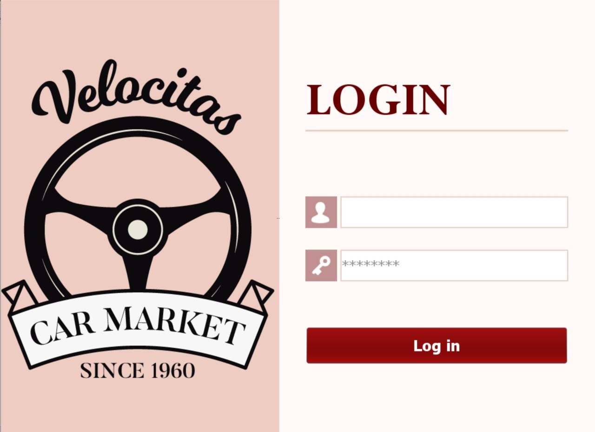
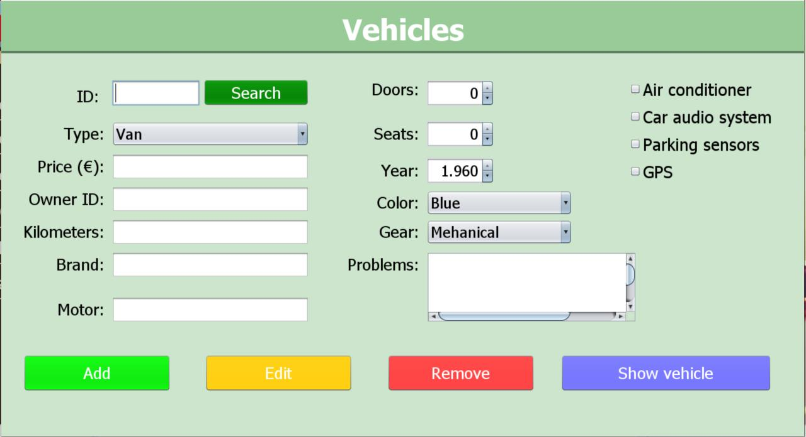
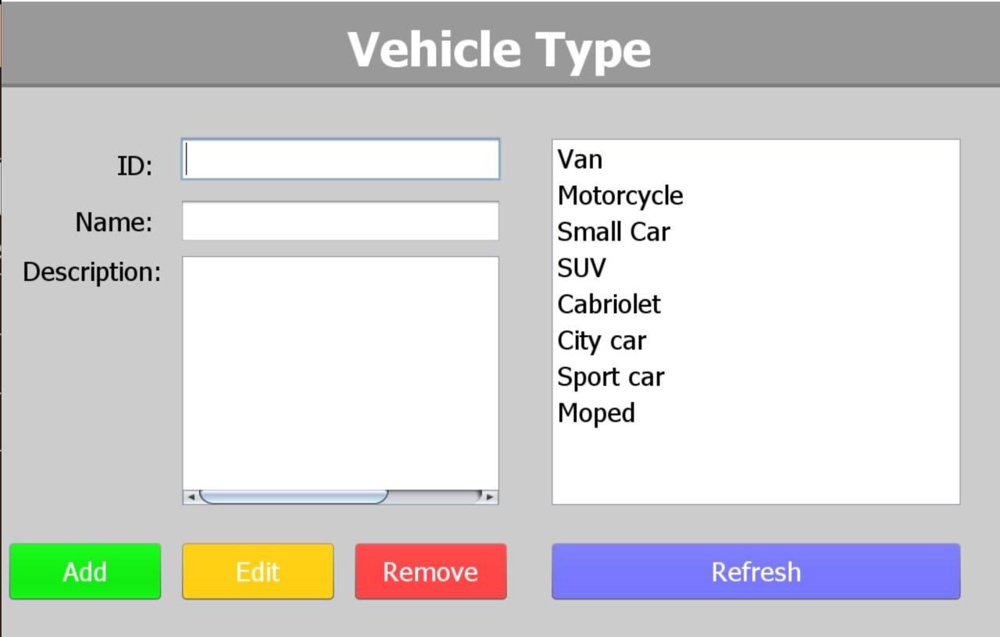
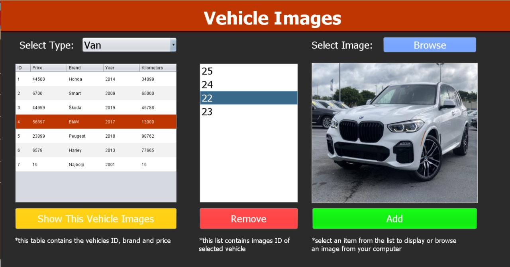
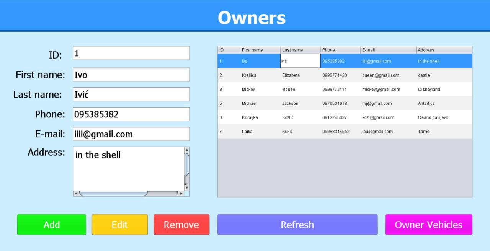
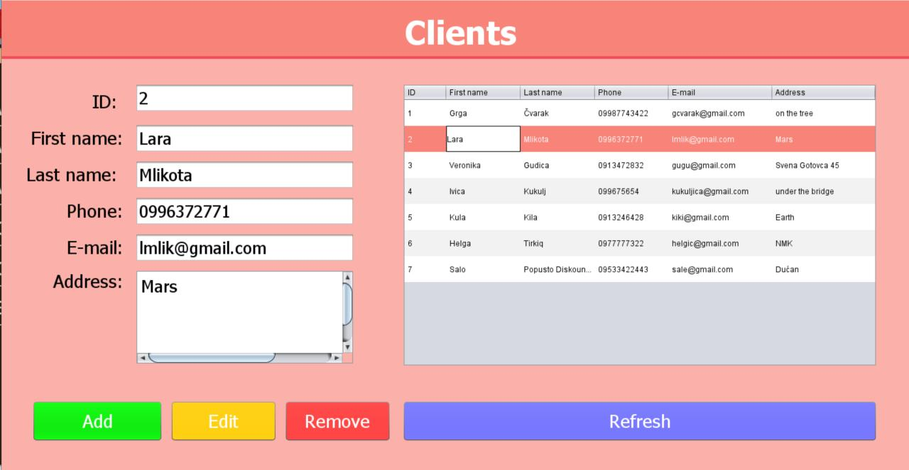
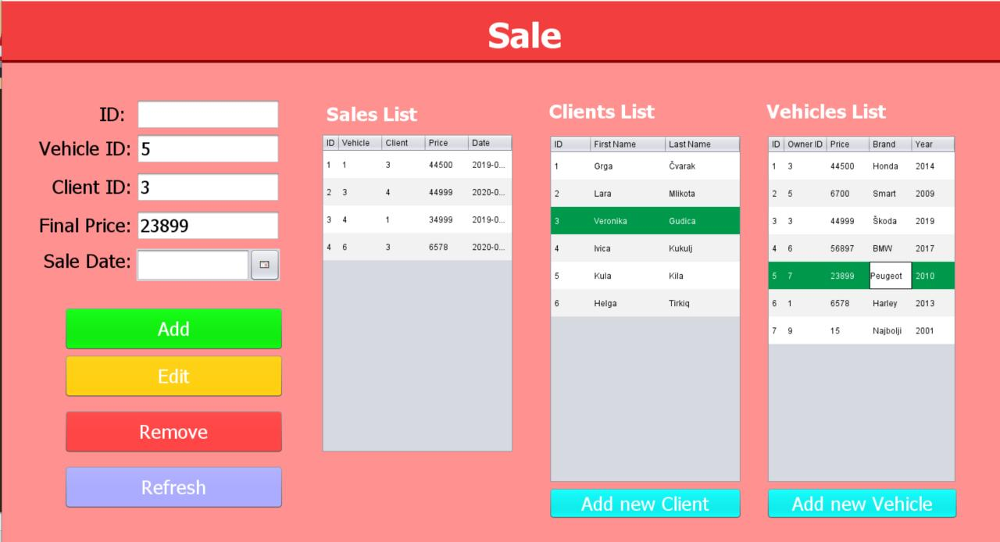

# CarMarket
Car Market app using Java language (Java 8), MySQL and Apache (v2.4.41). User interface was made by NetBeans (v8.0.2), so the whole app can be started from NetBeans panel. 

Full operating app for Car Market employees, where they can add new clients, owners and vehicles. Also they can manage sales in database.
App is functional with mySQL database (through XAMPP server), which contains seven tables. 

## How to start
I was using XAMPP server panel (version 3.2.4) where you can start MySQL and Apache server. There is possibility you will need to change port numbers, which you can do directly from this panel (Logs and Config buttons). Also from XAMPP localhost you can directly start and enter to PhpMyAdmin. My database has been exported to github, so it can be used. 

## About project
First window in the app is Login window where users have to insert their username and password, which are stored in our database.

After login window users can see Main window, which contains main app menu: 

From this window users can open various windows. First of them is Vehicle window, where user can add new vehicle in our DB, edit 
existing vehicles or delete them. Also from this window user can see all vehicles that are in our DB. 

Second one is Vehicle Type window, where user can add new type of vehicle in our DB. 

Third one is Vehicle Images window, where user can add or remove images of specific vehicles (that are listed in the window).

Next one is Owner window in which users can add, edit or delete owners in our DB, and also see which vehicles they owe.

Next one is Client window in which users can add, edit or delete clients in our DB.

And the last one is Sale window, which connects vehicles, owners and clients and contain sales. 

